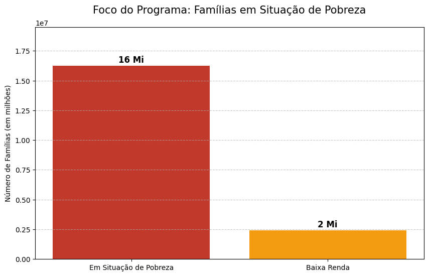
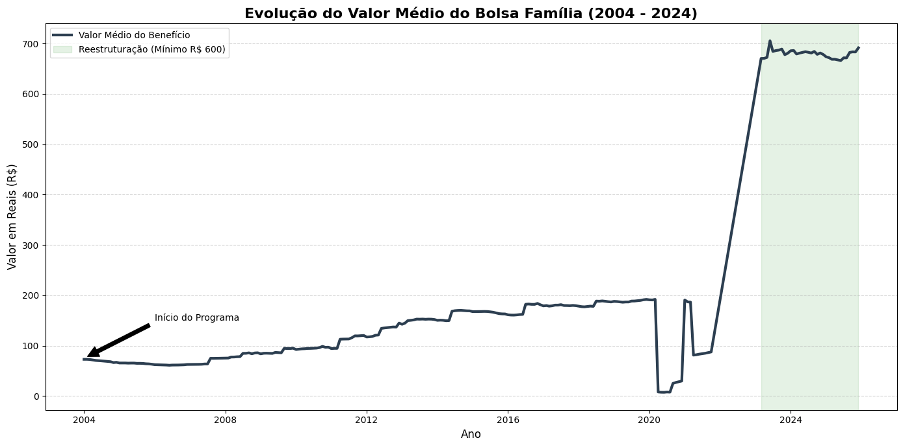
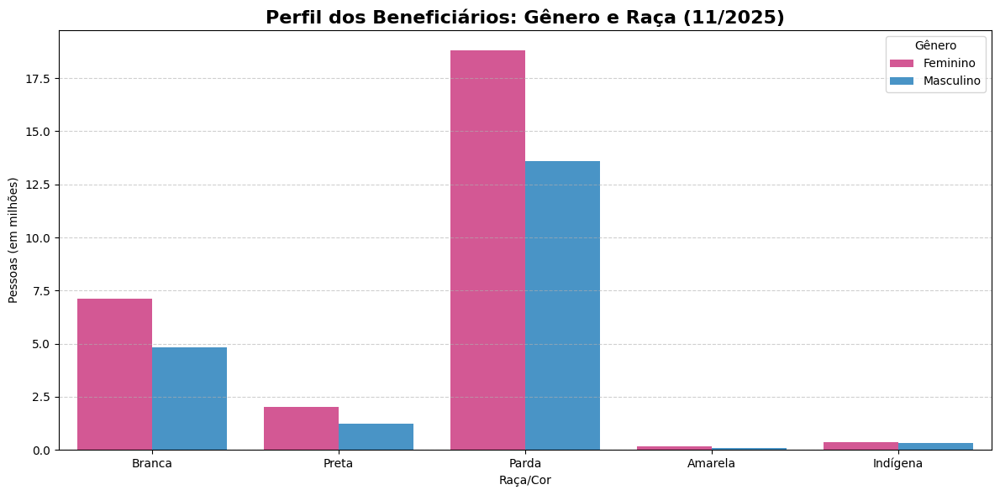

# Além do Mito: Uma Análise de Dados sobre a Estrutura Social do Bolsa Família

## 🎯 Objetivo do Projeto
Este projeto une a minha experiência de 15 anos como professor de História à minha trajetória como estudante de Ciência de Dados. O foco é investigar, por meio de evidências estatísticas, o senso comum e os mitos que cercam o programa **Bolsa Família**, especialmente a narrativa de que o auxílio estimularia o aumento da natalidade.

## 🛠️ Metodologia
A análise foi realizada utilizando dados abertos do governo federal (VIS Data 3). O processo envolveu:
* **Tratamento de Dados:** Limpeza de encodings (Latin-1), normalização de cabeçalhos e tratamento de valores monetários brasileiros.
* **Ferramentas:** Python, Pandas, Matplotlib e Seaborn no ambiente Google Colab.

---

## 📊 Resultados e Visualizações

### 1. Desmitificando o "Efeito Natalidade"
A análise da composição das famílias beneficiárias revela que o programa atende majoritariamente famílias pequenas (1 a 3 integrantes). A faixa de famílias numerosas (6 ou mais pessoas) é mínima e estável, o que contradiz a ideia de que o programa incentiva a geração de filhos.

### 2. O Foco na Vulnerabilidade Extrema
Os dados de renda per capita demonstram que o programa cumpre seu papel de política de segurança alimentar. A grande massa de beneficiários vive em situação de pobreza extrema, evidenciando que o auxílio é uma barreira contra a fome, e não um complemento para rendas estáveis.

### 3. Histórico do Benefício e Recomposição de Valor
A série histórica mostra como o valor médio do benefício se manteve estagnado por anos e precisou de uma recomposição drástica em 2023 para enfrentar a inflação dos alimentos e a crise econômica pós-pandemia.

### 4. O Rosto da Desigualdade: Gênero e Raça
Ao cruzar gênero e raça, o dado revela o perfil social da pobreza no Brasil: a maioria esmagadora das titulares do programa são **mulheres pretas e pardas**, demonstrando que o Bolsa Família é também um instrumento de reparação e autonomia feminina.

---

## 🏛️ Conclusão
Como historiador, vejo que os dados desmentem preconceitos enraizados. O Bolsa Família não cria famílias grandes; ele sustenta famílias que já são pequenas, mas que enfrentam a exclusão histórica. Como cientista de dados, vejo um programa eficiente em seu alvo, mas que ainda reflete as profundas desigualdades de gênero e raça do nosso país.

---

## 👨‍🏫 Autor
**Caio Vinicius Detoni*
*Professor de História e Estudante de Ciência de Dados*
- [LinkedIn](www.linkedin.com/in/caioviniciusdetoni)
